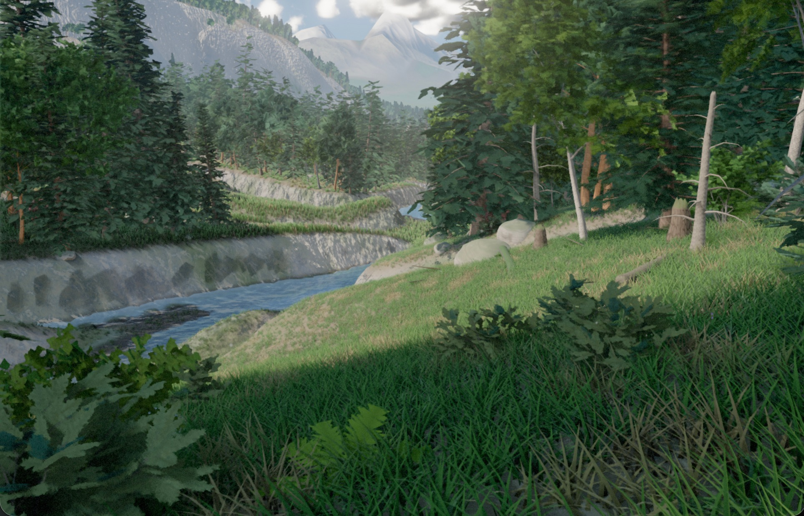

# LAAS

*laas — Estonian for old-growth forest.*



Unedited engine output. Every mesh, texture, and light in this frame is generated by code at boot — the repository contains no image, model, or audio assets.

LAAS is a fully procedural 4×4 km open world running in the browser on WebGPU: three.js `WebGPURenderer` with TSL materials and raw WGSL compute, TypeScript strict with zero `any`, no WebGL fallback. The entire world is reproducible from a single URL parameter (`?seed=N`).

## The experiment

The goal of this project is to test the capabilities of Claude Fable 5, Anthropic's newest model. This repository was built roughly 99% by the model, with minimal human steering:

- The human partially wrote one document: [PROJECT_LAAS_v2.md](PROJECT_LAAS_v2.md) — the brief. It sets the visual bar (UE5-class reference frames), hard floors (triangle counts, system list, world size), and banned outcomes (black shadows, cloned trees, fog as cover). It deliberately does not say how to build any of it.
- Everything else was planned and executed by Fable 5 across long autonomous sessions: the architecture, all engine and world systems, the verification tooling, the debugging, the working notes, and this README.
- Human input is limited to rare feedback on the things a model cannot judge well from static output: whether motion effects feel right, whether interactive performance holds up, whether an artifact is visible while moving. Examples from the log: wind sway amplitude, walk-camera bob, cloud motion lagging the camera, water coverage taste.

The model does its own QA. It boots the world headless (Playwright driving Chromium with a WebGPU/Metal adapter), takes screenshots, samples pixels, diffs frames against baselines with frame-aligned determinism, profiles GPU passes per encoder, and writes regression probes for the bugs it finds. The diagnosis logs, measurements, and decisions live in [STATUS.md](STATUS.md), which serves as the model's durable memory between sessions.

Current state: about 21,000 lines of strict TypeScript across 90+ commits, all phases of the brief built, with an ongoing performance pass. Known open issues are tracked at the top of STATUS.md.

## What is in the world

- Terrain: 4096² heightfield synthesis, pipe-model hydraulic plus thermal erosion, flow-accumulation rivers carving real channels into lakes with outlets, moisture and biome classification, slope- and exposure-driven snow. CDLOD quadtree meshing with crack-free skirts and far-shell detail synthesis to a 4 km+ visible range.
- Vegetation: six tree species grown by a procedural branching grammar with per-instance uniqueness (no two trees share a mesh), cluster-card foliage baked from real generated leaf geometry, octahedral impostors, three shrub classes, ferns, flowering plants, deadfall with decay states. Around 190,000 trees and 450,000 understory instances are placed by GPU clustered-Poisson scatter and culled per frame into compacted indirect draws; meadows render roughly a million grass blades.
- Lighting: four-cascade shadow maps with PCSS and screen-space contact shadows, a terrain-relative irradiance-probe field for GI, GTAO, screen-space bounce, foliage translucency. A no-black-shadows rule is enforced by automated pixel sampling.
- Atmosphere: Hillaire LUT atmosphere driving sky, aerial perspective and light color; raymarched volumetric clouds with cloud shadows; froxel volumetrics for canopy light shafts and valley fog.
- Water: stream and lake surfaces on a camera-following clipmap, screen-space reflections with terrain-aware fallbacks, analytic caustics, obstacle foam, wet margins.
- Motion: hierarchical wind through every plant, 131,072 GPU particles (snow, pollen, drifting leaves), drifting and churning cloud fields.
- Post: temporal AA with analytic camera-reprojection velocity, bloom, GPU auto-exposure, per-time-of-day filmic grade.
- Exploration: walk mode with gravity, jumping, sprint and stride-matched camera motion; free-fly mode; nine composed bookmarks; a 90-second flythrough.

## Running it

```
npm install
npm run dev
```

Open `http://localhost:5173` in Google Chrome 113 or newer on a desktop or laptop. Other Chromium-based browsers (Edge, Brave, Arc, Opera) should work too. Safari and Firefox are not supported — the engine is built and tested against Chrome's WebGPU implementation, and the page detects this before loading and says so. Mobile and tablet browsers get a notice recommending a computer. There is no WebGL fallback by design: if Chrome is present but WebGPU is unavailable, the page fails loudly with diagnostics and the exact things to check (hardware acceleration, `chrome://gpu`, browser version).

Controls: click to capture the mouse. WASD to move, Shift to sprint, Space to jump, V toggles walk/fly, mouse wheel sets fly speed, E/Q move vertically in fly mode. Keys 1–9 jump to composed bookmarks, F starts the flythrough, F3 opens the debug HUD with per-pass GPU timings, P prints the current camera pose as a `?cam=` string.

Useful URL parameters: `?seed=N` (world seed), `?T=hours` (time of day, 0–24), `?shot=1..9` (boot into a bookmark), `?cam=x,y,z,yaw,pitch[,fov]` (exact pose), `?preset=low|high|ultra`, `?freeze=1` (freeze world motion), `?hud=1` (HUD open at boot).

## Repository map

| Path | What it is |
|---|---|
| `PROJECT_LAAS_v2.md` | The brief. The only human-authored document in the repository. |
| `STATUS.md` | The model's working memory: current state, diagnosis logs, measurements, decision history. |
| `docs/THREE-NOTES.md` | Verified three.js/TSL/WebGPU API notes the model accumulated against the pinned version. |
| `docs/DELTA.md`, `docs/DEVIATIONS.md` | Reference-comparison loops per phase, and spec deviations with reasons. |
| `src/` | Engine and world: `core/`, `gpu/`, `world/`, `vegetation/`, `render/`, `sky/`, `debug/`. |
| `tools/` | The model's verification harness: headless WebGPU screenshots, image comparison, pixel sampling, GPU profiling, bug-specific probes. |
| `reference/` | The reference frames the world is judged against. |
